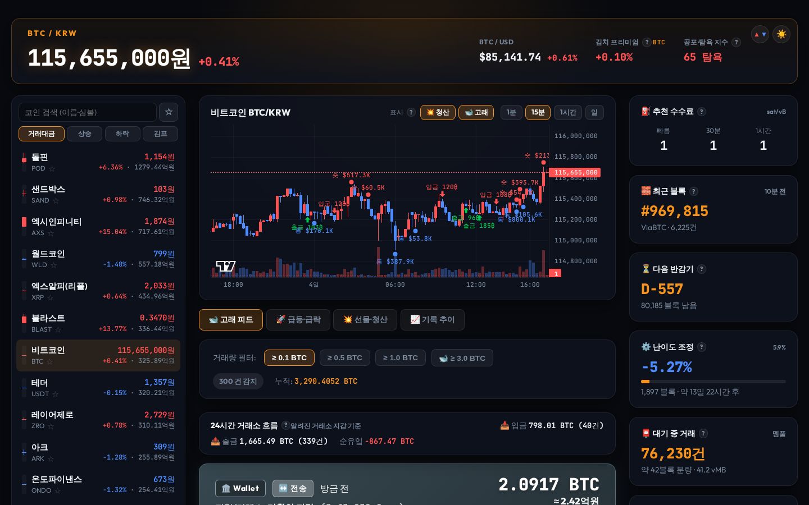
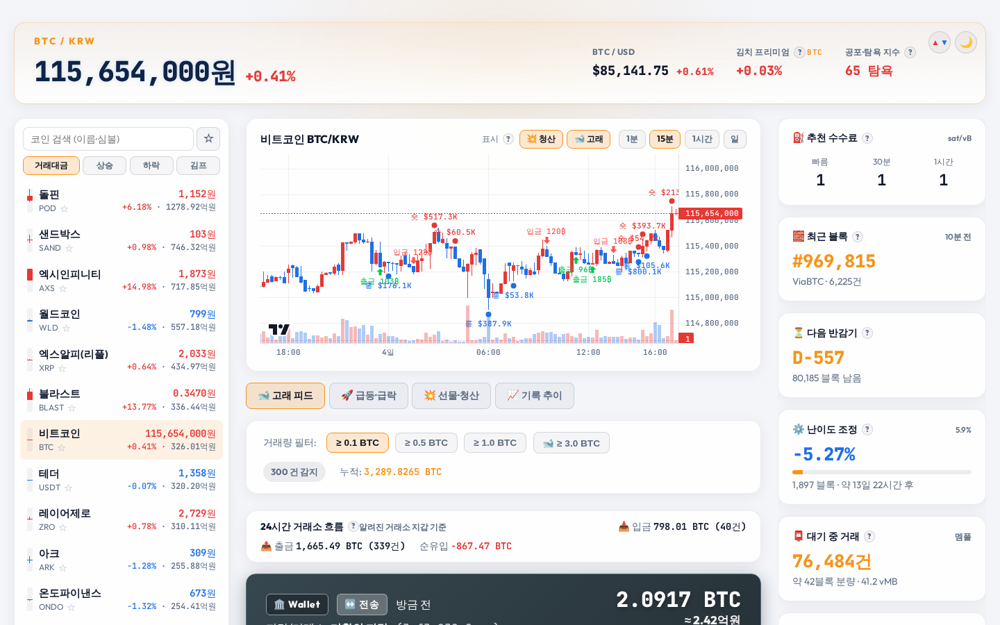
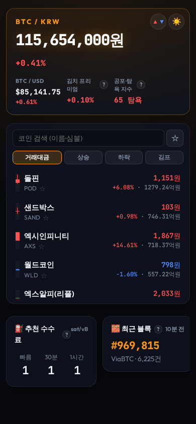

# ⚡ 고래 지갑 추적기 (Bitcoin Real-Time Whale Tracker)

고래 지갑 추적기는 **비트코인 고래 거래 감지**, **업비트 원화 시세·차트(원화 마켓 전체)**, **김치 프리미엄**, **바이낸스 선물 지표·강제청산**, **비트코인 네트워크 현황**을 한 화면에 보여 주는 한국 사용자용 실시간 대시보드입니다. 사이드바에서 코인을 고르면 차트와 상단 시세 바가 함께 그 코인으로 바뀝니다. 데스크톱 브라우저 기준으로 설계했습니다.

🔗 **라이브 사이트**: [https://wallet-track-theta.vercel.app](https://wallet-track-theta.vercel.app)

---

## 📸 프로젝트 화면 (Screenshot)







> 스크린샷은 `npm run screenshots`로 다시 찍습니다. 화면을 바꾸면 같이 갱신해 주세요.

---

## ✨ 핵심 기능

### 1. 코인 사이드바 & 가격 차트
- **업비트 원화 마켓 전체**를 왼쪽 사이드바에 보여 주고, 한글·영문 이름·심볼로 **검색**, **거래대금 / 상승 / 하락 / 김프** 순으로 정렬합니다. 누르면 가운데 차트와 상단 시세 바가 그 코인으로 바뀝니다.
- **코인별 김프**: 김프 버튼을 누르면 바이낸스 현물 달러 가격 기준 김프가 높은 순으로 정렬하고 각 줄에 김프를 보여 줍니다 (한 번 더 누르면 낮은 순, 역프 먼저). 바이낸스에 없는 코인은 맨 아래에 둡니다.
- **관심 코인**: 심볼 옆 ☆을 누르면 관심 코인으로 저장하고(이 브라우저에만), 검색창 옆 ☆ 버튼으로 관심 코인만 볼 수 있습니다.
- 코인마다 **오늘 일봉 미니 캔들**(꼬리 = 저가~고가, 몸통 = 시가~현재가)을 그립니다. 모든 코인을 시가 대비 ±15% 같은 눈금으로 그려서 크게 움직인 코인일수록 막대가 길게 꽉 찹니다.
- 가격·등락률은 업비트 WebSocket으로 실시간 갱신합니다 (줄 순서는 30초마다 다시 매김).
- **캔들 차트** (TradingView lightweight-charts): 1분 / 15분 / 1시간 / 일봉, 거래량 막대. 차트를 왼쪽 끝 가까이 옮기면 **이전 캔들 200개씩 이어서** 불러옵니다.
- **차트 표시 (💥 청산 · 🐋 고래)**: 캔들 구간마다 그 코인의 바이낸스 선물 강제청산 합계가 큰 곳을 찍습니다 (롱 청산은 캔들 아래, 숏 청산은 위). 비트코인 차트에는 큰 거래소 입금·출금(고래)도 찍습니다. 기록 서버가 모은 기간만 보이며, 버튼으로 켜고 끕니다.

### 2. 상단 시세 바
- **지금 보고 있는 코인**의 업비트 원화 실시간 가격과 전일 대비(오전 9시 기준), 바이낸스 달러 가격과 24시간 변동 (처음엔 BTC)
- **김치 프리미엄** (그 코인 기준): `업비트 원화 가격 ÷ (바이낸스 달러 가격 × 업비트 USDT 원화 가격) - 1`. 환율 대신 업비트 USDT 가격을 씁니다. 차이가 ±50%를 넘으면 같은 심볼의 다른 코인으로 보고 표시하지 않습니다.
- **공포·탐욕 지수** (alternative.me)
- ☀️/🌙 **라이트·다크 모드** 전환 (처음엔 시스템 설정을 따름)
- ▲▼ **상승·하락 색** 전환: 기본은 국내식(상승 빨강 / 하락 파랑), 누르면 해외식(상승 초록 / 하락 빨강). 차트·사이드바·등락률·청산 색이 모두 따라 바뀝니다 (고래 입금·출금 카드 색은 고정)

### 3. 🐋 고래 피드 탭
- mempool.space WebSocket으로 비트코인 미확인 거래를 실시간 수신, `≥ 0.1 / 0.5 / 1.0 / 3.0 BTC` 필터
- 알려진 거래소 지갑 기준 **입금 / 출금 / 전송** 판정, 거스름돈 출력 제외
- 24시간 거래소 입금·출금·순유입 (기록 서버)

### 4. 🚀 급등·급락 탭
- 업비트 원화 마켓 전체에서 **최근 5분 최저가보다 ±2 / 3 / 5 / 10% 이상 오르거나, 최고가보다 그만큼 내린 코인**을 실시간 피드로 보여 줍니다. 누르면 차트가 그 코인으로 바뀝니다.
- 같은 코인·방향은 10분 동안 다시 올리지 않고(그 사이 기준만큼 더 움직이면 다시 올림), 24시간 거래대금 5억원 미만 코인은 뺍니다.
- 탭을 보고 있지 않을 때 새로 잡힌 개수를 탭에 표시하고, **화면 알림**을 켜면 토스트로도 알려 줍니다. 페이지를 연 뒤부터 모읍니다.

### 5. 💥 선물·청산 탭 (바이낸스 USDⓈ-M)
- 요약 띠: **BTCUSDT 펀딩비**(다음 정산까지), **미결제약정**, **롱/숏 계정 비율**
- **실시간 강제청산 피드** (전체 선물 마켓, $1K 이상)와 롱/숏 청산 합계
- **청산 통계**: 1/4/24시간 롱·숏 합계, 24시간 코인별 TOP 5
- **코인별 펀딩비** 표

### 6. 📈 기록 추이 탭
- 코인별 **김치 프리미엄 추이**, **선물 지표 추이**(펀딩비·미결제약정·롱 비율) — 24시간 / 7일 / 30일
- 기록 서버 DB를 씁니다. 수집기를 켜기 전 기간은 거래소 과거 데이터로 채워 둡니다 (김프 90일, 선물 30일, 1시간 간격).

### 7. 사이드 패널
- **비트코인 네트워크**: 추천 수수료, 최근 블록, 다음 반감기, 난이도 조정, 대기 중 거래(멤풀) — mempool.space
- **오늘 시세**(지금 보고 있는 코인의 고가·저가), **환산 계산기**(BTC ↔ 사토시 ↔ 원 ↔ $)
- **알림**: BTC 가격, 김프, 고래 거래 (브라우저 알림 + 화면 토스트)
- **🔊 사운드 알림**: 큰 강제청산·BTCUSDT 대량 체결이 나면 소리 (기준 금액 선택). 처음 방문하면 켤지 묻습니다.
  - 소리는 8비트 아르페지오(도·미·솔, 내려갈 땐 거꾸로)이고 볼륨을 조절할 수 있습니다.
  - 청산 금액이 $100K · $500K · $2M을 넘을 때마다 단계가 올라가 더 크고 낮게 울리고, 3단계부터 저음 쿵·반복, 4단계는 폭발음이 겹칩니다 (체결은 기준 금액의 3·10·30배). '청산 단계별 미리 듣기'로 4단계를 차례로 들어 볼 수 있습니다.

### 8. 용어 설명 & 의견
- 김프, 펀딩비, 미결제약정, 반감기 등 어려운 용어 제목 옆 **`?` 버튼**을 누르면 짧은 설명이 뜹니다.
- 사이트 아래 **의견 보내기**, 익명 사용 기록(개인정보·IP 미저장, 끌 수 있음)

### 9. 기록 서버 (`server/`)
- 수집기가 고래 거래, 강제청산, 선물 지표, 김프를 24시간 모아 PostgreSQL에 저장하고, 읽기 전용 API로 지난 기록을 제공합니다.
- 업비트 REST 시세·캔들은 이 서버를 거쳐 받습니다 (업비트가 브라우저 요청을 출처별로 강하게 제한하기 때문).
- Docker Compose로 실행합니다. 배포·운영 방법은 [server/README.md](server/README.md)를 참고하세요.

---

## 🛠 기술 스택 (Tech Stack)

- **Frontend**: Vite, TypeScript, Vanilla CSS (Glassmorphism Modern Dark UI), lightweight-charts (캔들 차트)
- **Fonts**: Google Fonts (Outfit, JetBrains Mono)
- **Real-Time Engine**: WebSocket (mempool.space, 업비트 원화 마켓 전체 시세, 바이낸스 현물(BTC 시세, 코인별 달러 시세)·선물 시세·강제청산·체결)
- **Data APIs**: mempool.space (수수료·블록·난이도), alternative.me (공포·탐욕 지수), 업비트 캔들·시세(기록 서버 중계), 바이낸스 현물·선물 (시세, 펀딩비, 미결제약정, 롱/숏 비율) — API 키 없음
- **Backend**: Node.js (TypeScript), PostgreSQL, Docker Compose, nginx
- **Deployment**: 웹 Vercel (`main` 푸시 시 자동 배포), 서버 OCI

---

## 🚀 시작하기 (Quick Start)

### 1. 저장소 클론 및 패키지 설치
```bash
git clone https://github.com/Joinjun001/WalletTrack.git
cd WalletTrack
npm install
```

### 2. 개발 서버 실행
```bash
npm run dev
```
웹 브라우저에서 `http://localhost:5173` 으로 접속하여 실시간 대시보드를 확인합니다.

---

## 📜 스크립트 명령어 (Scripts)

| 명령 (Command) | 설명 (Description) |
|---|---|
| `npm run dev` | Vite 기반 로컬 개발 서버 실행 |
| `npm run build` | 프로덕션 빌드 번들 생성 (`dist/`) |
| `npm run preview` | 프로덕션 빌드 미리보기 |
| `npm test` | 시세·거래 분석 로직 단위 테스트 (`node:test`) |
| `npm run typecheck` | TypeScript 타입 검사 |
| `npm run screenshots` | 빌드 후 README 스크린샷(`image/`) 다시 찍기 (처음 한 번 `npx playwright install chromium`) |

---

## 📁 프로젝트 구조 (Project Structure)

```
WalletTrack/
├── index.html                # 메인 대시보드 HTML
├── CLAUDE.md                 # 작업 규칙 (같은 문제 전체 점검, 화면 변경 시 문서·스크린샷 갱신)
├── image/                    # README 스크린샷 (npm run screenshots)
├── scripts/
│   └── screenshots.mjs       # 스크린샷 자동 촬영 (Playwright)
├── src/
│   ├── main.ts               # 진입점: 탭 전환 & 각 패널 초기화
│   ├── coinSidebar.ts        # 왼쪽 코인 사이드바 (업비트 원화 마켓 전체, 검색·정렬·김프·관심 코인)
│   ├── selectedCoin.ts       # 지금 보고 있는 코인 (차트·상단 시세 바·오늘 시세가 따라감)
│   ├── priceChart.ts         # 업비트 캔들 차트 (과거 캔들 이어 불러오기, 청산·고래 표시)
│   ├── krMarket.ts           # 업비트 시세 WebSocket(공유), 상단 시세 바(고른 코인), 공포·탐욕 지수
│   ├── binanceSpot.ts        # 바이낸스 현물 코인별 달러 시세 (김프)
│   ├── surgeFeed.ts          # 급등·급락 포착 탭
│   ├── btcWhaleTracker.ts    # 고래 피드 (mempool.space) & 달러 시세
│   ├── futuresPanel.ts       # 바이낸스 선물 지표 & 강제청산 피드
│   ├── historyApi.ts         # 기록 서버 호출 & 업비트 중계 호출(getUpbit)
│   ├── historyCharts.ts      # 기록 추이 차트 (김프, 선물 지표)
│   ├── historyStats.ts       # 청산 통계, 거래소 흐름
│   ├── networkPanel.ts       # 수수료, 최근 블록, 반감기, 난이도, 멤풀
│   ├── tools.ts              # 환산 계산기 & 가격·김프·고래 알림
│   ├── soundAlerts.ts        # 청산·대량 체결 사운드 알림 (기준·소리 종류·볼륨)
│   ├── sounds.ts             # 알림 소리 합성 (Web Audio, 8비트 × 금액별 4단계)
│   ├── help.ts               # 용어 설명 ? 버튼
│   ├── theme.ts              # 라이트·다크 모드, 상승·하락 색(국내식/해외식)
│   ├── analytics.ts, feedback.ts  # 익명 사용 기록, 의견 보내기
│   ├── coins.ts              # 주요 코인 목록 & 코인 이름
│   ├── priceStore.ts         # 패널 간 공유 시세 상태
│   ├── market.ts             # 김프/포맷/캔들/알림 판정 순수 로직 (서버와 공유)
│   ├── txAnalysis.ts         # 금액/입출금 판정 순수 로직 & 거래소 지갑 목록 (서버와 공유)
│   └── style.css             # 디자인 (CSS 변수로 라이트·다크 테마)
├── server/                   # 수집기 & 기록 API & 업비트 중계 (Docker Compose, server/README.md)
├── tests/
│   ├── market.test.ts        # 시세/네트워크 계산 테스트
│   └── txAnalysis.test.ts    # 분석 로직 테스트
├── package.json
├── vite.config.ts
└── tsconfig.json
```

---

## 📄 라이선스 (License)

ISC License
