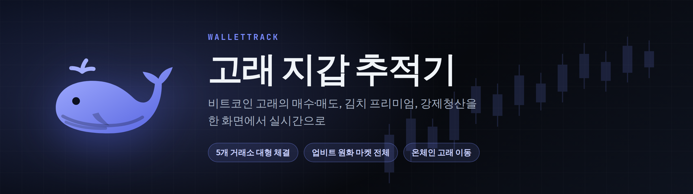

<p align="center">
  
</p>

<p align="center">
  <a href="https://wallet-track-theta.vercel.app"></a>
  
  
  
</p>

비트코인 고래의 움직임과 시장 흐름을 한 화면에서 실시간으로 보는 한국 사용자용 대시보드입니다.

**https://wallet-track-theta.vercel.app**


## 핵심 기능

| 기능 | 설명 |
|---|---|
| 고래 체결 | 바이낸스·바이비트·OKX·업비트에서 BTC·ETH·XRP·SOL·DOGE를 한 번에 크게(1 BTC 가치 이상) 사고판 주문을 실시간으로. 1시간·하루·1주·1달 매수·매도 합계 |
| 고래 입출금 | 거래소 지갑으로 들어가고 나가는 큰 비트코인 송금(온체인). 차트 위에도 표시 |
| 강제청산 | 실시간 청산 피드와 통계 (BTC·ETH·XRP·SOL·DOGE별 또는 전체). 큰 청산은 차트 위에 표시 |
| 소리·화면 알림 | 관심 코인을 최대 5개 골라 강제청산·대형체결을 소리로, 가격·김프·고래 체결은 브라우저 알림으로 |
| 시세와 차트 | 업비트 원화 마켓 전체 시세, 코인별 김치 프리미엄, 급등·급락 포착, 1분~월봉 캔들 차트 |
| 선물 지표 | 펀딩비, 미결제약정, 롱/숏 비율과 추이 |

## 실행하기

```bash
npm install
npm run dev          # http://localhost:5173
```

지난 기록(고래 체결 합계, 청산 통계, 김프 추이 등)은 `server/`의 기록 서버가 모읍니다. 실행 방법은 [server/README.md](server/README.md)를 보세요.

## 업데이트 내역

날짜별로 달라진 점은 [CHANGELOG.md](CHANGELOG.md)에 있어요.

## 기술 스택

Vite · TypeScript · lightweight-charts · Node.js · PostgreSQL · Docker Compose · Vercel

## License

ISC
