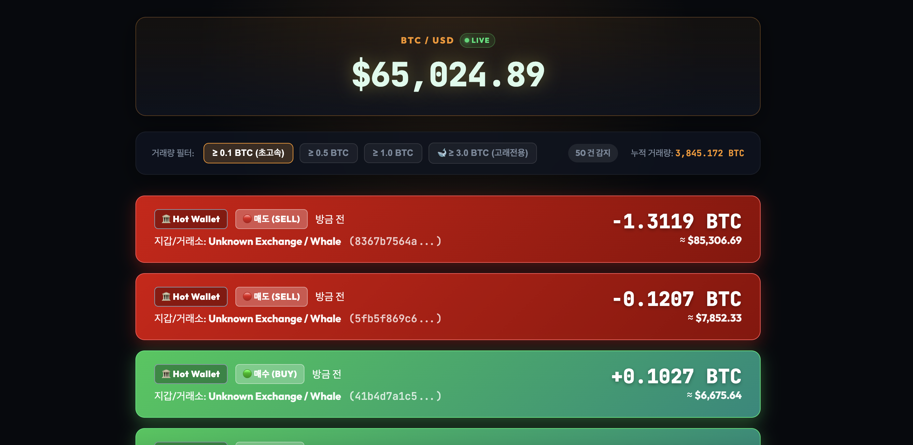

# ⚡ 고래 지갑 추적기 (Bitcoin Real-Time Whale Tracker)

고래 지갑 추적기는 **비트코인(BTC) 실시간 트랜잭션 수신**, **고래(Whale) 이동 감지**, 및 **실시간 비트코인 시세 스트리밍**을 제공하는 초고속 Web3 트래커 웹 애플리케이션입니다.

🔗 **Vercel 라이브 데모**: [https://wallet-track-e2ze8d2py-joinjun001s-projects.vercel.app](https://wallet-track-e2ze8d2py-joinjun001s-projects.vercel.app/)

---

## 📸 프로젝트 화면 (Screenshot)



---

## ✨ 핵심 기능

### 1. 실시간 비트코인 트랜잭션 감지
- **WebSocket 연동 (`wss://ws.blockchain.info/inv`)**: 비트코인 블록체인에서 생성되는 미확인(Unconfirmed) Mempool 트랜잭션을 딜레이 없이 실시간으로 수신합니다.
- **주요 글로벌 거래소 핫월렛 태깅**: 바이낸스(Binance), 코인베이스(Coinbase), 비트파이넥스(Bitfinex), 로빈후드(Robinhood), OKX, 크라켄(Kraken) 등 유명 거래소의 핫 월렛(Hot Wallet)을 실시간으로 감지하고 매수/매도 라벨을 표시합니다.
- **고래(Whale) 임계값 필터링**: `≥ 0.1 BTC`, `≥ 0.5 BTC`, `≥ 1.0 BTC`, `🐋 ≥ 3.0 BTC` 버튼으로 원하시는 규모의 트랜잭션만 즉시 필터링할 수 있습니다.

### 2. 실시간 비트코인 시세
- **초단위 시세 스트리밍 (`wss://stream.binance.com:9443/ws/btcusdt@ticker`)**: 1초 미만(틱 단위)으로 바이낸스 기준 비트코인 가격 변경을 감지합니다.
- **실시간 Visual Glow 애니메이션**:
  - 가격 상승 시 🟢 초록색 글로우 펄스 이펙트 (`price-up`)
  - 가격 하락 시 🔴 빨간색 글로우 펄스 이펙트 (`price-down`)
- **실시간 스트리밍 배지**: 상단 헤더에 `🔴 LIVE` 상태 배지를 통해 WebSocket 연결 여부를 직관적으로 보여줍니다.

---

## 🛠 기술 스택 (Tech Stack)

- **Frontend**: Vite, TypeScript, Vanilla CSS (Glassmorphism Modern Dark UI)
- **Fonts**: Google Fonts (Outfit, JetBrains Mono)
- **Real-Time Engine**: WebSocket (Blockchain.info Mempool API, Binance Market Ticker API)
- **Deployment**: Vercel

---

## 🚀 시작하기 (Quick Start)

### 1. 저장소 클론 및 패키지 설치
```bash
git clone https://github.com/Joinjun001/WalletTrack.git
cd WalletTrack
npm install
```

### 2. 개발 서버 실행
```bash
npm run dev
```
웹 브라우저에서 `http://localhost:5173` 으로 접속하여 실시간 대시보드를 확인합니다.

---

## 📜 스크립트 명령어 (Scripts)

| 명령 (Command) | 설명 (Description) |
|---|---|
| `npm run dev` | Vite 기반 로컬 개발 서버 실행 |
| `npm run build` | 프로덕션 빌드 번들 생성 (`dist/`) |
| `npm run preview` | 프로덕션 빌드 미리보기 |

---

## 📁 프로젝트 구조 (Project Structure)

```
WalletTrack/
├── index.html                # 메인 대시보드 HTML
├── image/
│   └── image1.png            # 프로젝트 스크린샷 이미지
├── src/
│   ├── btcWhaleTracker.ts    # 비트코인 Mempool & Binance 시세 WebSocket 엔진
│   └── style.css             # Glassmorphism 디자인 시스템 & 애니메이션
├── package.json
├── vite.config.ts
└── tsconfig.json
```

---

## 📄 라이선스 (License)

ISC License
